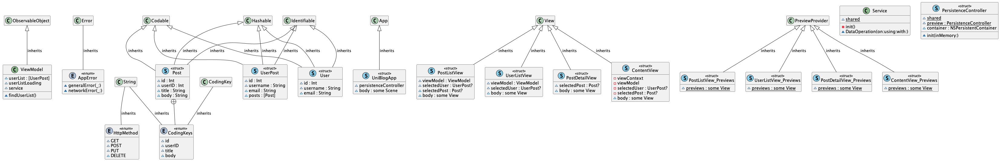

Universal Blogger
=================

This is a 3-layer application that demos a 3-tier structure.

<!-- TOC -->
* [Universal Blogger](#universal-blogger)
* [Overview](#overview)
  * [Presentation Layer](#presentation-layer)
    * [iOS App](#ios-app)
  * [Application Layer](#application-layer)
    * [Java Spring Boot Application](#java-spring-boot-application)
  * [Data Layer](#data-layer)
    * [PostgreSQL database](#postgresql-database)
<!-- TOC -->

# Overview

The individual components are:

- Presentation
    - iOS native App to enter and manage blog entries.
- Application
    - Java application exposed through a **Spring Boot** REST service
- Data
    - A docker container with:
        - **postgreSQL** database
        - **pgAdmin** administration utility

## Presentation Layer
### iOS App
This is the main user interface for the blogging experience.

The architecture f the App is MVVM using SwiftUI.

## Application Layer
### Java Spring Boot Application
This is the business logic that runs the **REST Service**

Documentation is in the [detailed java application documentation page](docs/javaApplication/html/index.html)

### REST Service API Reference
This is the communication entry point betqween the applucation business logic and the user interface.

## Data Layer
### PostgreSQL database
This is the implementation of the storage layer.

The database engine is containerized in docker.