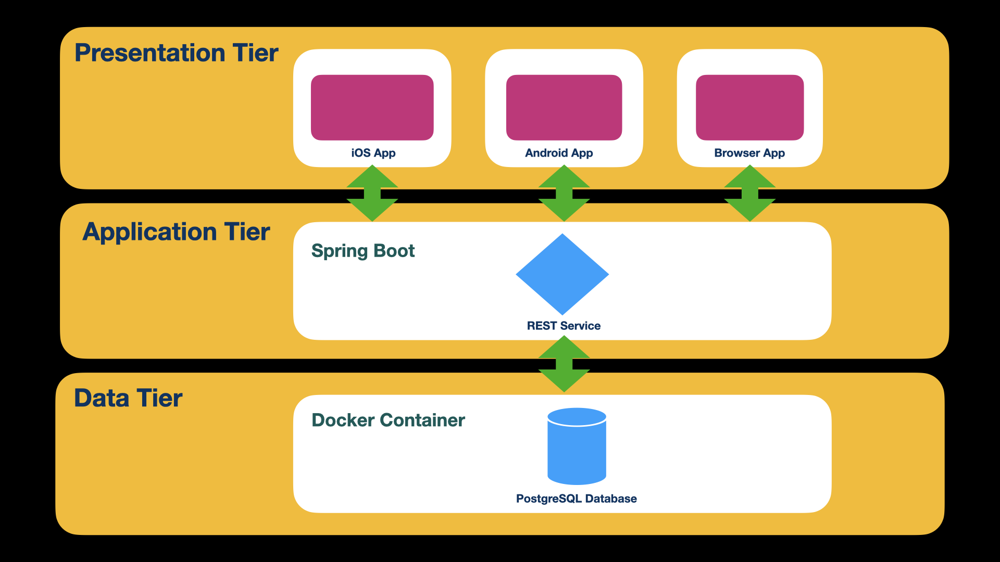
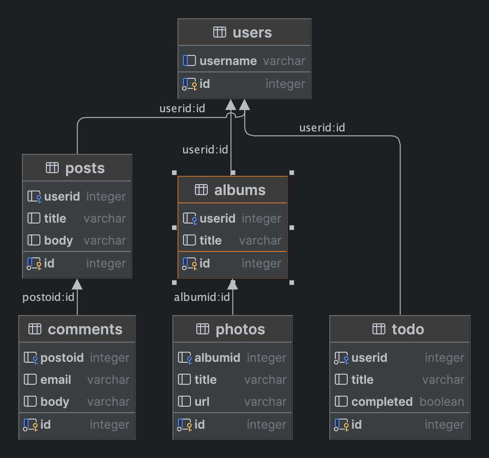

# Universal Blogger

## Overview
This is  implemented as a 3-Tier Application:
* Data Tier
    * Docker Container
        * *PostGreSQL* Database System
        * *pgAdmin* Administration Application to manage the database engine
* Application Tier
    * Spring Boot
        * REST Service
* Presentation Tier
    * iOS App
    * Android App
    * Browser-based app

### Application Structure

### Database structure
